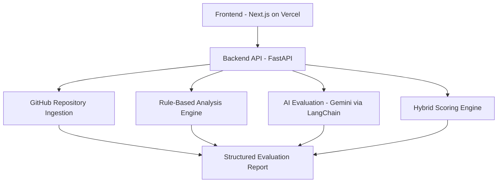

# GitInsight 🚀  
**AI-Powered GitHub Project Reviewer for Internship Readiness**

GitInsight is an AI-powered tool that analyzes public GitHub repositories and generates a structured, recruiter-style evaluation report. It helps students and early-stage developers understand how strong their projects really are, what needs improvement, and how to present them effectively on resumes.

---

## 🔍 Problem Statement

Students actively build projects and publish them on GitHub, but many repositories fail to create a strong impression on recruiters and internship evaluators.  
The issue is not a lack of skill, but poor project presentation—weak documentation, unclear structure, and no clear indication of internship readiness.

As a result, strong projects often get ignored due to lack of clarity rather than lack of quality.

---

## 💡 Solution Overview

GitInsight bridges the gap between **building a project** and **presenting it professionally**.

Given a public GitHub repository link, GitInsight:
- Analyzes project structure and documentation
- Evaluates code clarity and tech stack usage
- Scores the project using internship-oriented rubrics
- Generates actionable improvement suggestions
- Produces resume-ready project bullet points

The evaluation is designed to reflect how a **recruiter** would assess a GitHub project.

---

## ✨ Key Features

- 📂 Full GitHub repository analysis
- 🧠 Multi-step AI evaluation pipeline
- 📊 Internship-readiness scoring
- 🛠 Actionable improvement suggestions
- 📄 Resume-ready project bullet generation
- ⚙️ Hybrid scoring (rules + AI for credibility)

---

## 🧱 Architecture Overview



---

## 🛠 Tech Stack

### Backend
- Python
- FastAPI
- LangChain
- Google Gemini API

### Frontend
- Next.js / React
- Deployed on Vercel

### Data & Services
- GitHub REST API
- Firebase (optional, lightweight persistence)

### DevOps
- Docker
- Environment-based configuration
- CI/CD via hosting platform

---

## 🚦 How It Works

1. User submits a public GitHub repository URL
2. Backend fetches repository structure and files
3. Rule-based checks analyze structure and documentation
4. AI evaluates quality, clarity, and readiness
5. Hybrid scoring engine produces consistent scores
6. A structured report is generated and returned

---

## 📊 Evaluation Criteria

Projects are evaluated across:
- Documentation quality
- Project structure
- Code clarity
- Tech stack usage
- Overall internship readiness

Scores are **guidance-oriented**, not absolute judgments.

---

## 🚀 Getting Started (Local Setup)

### Prerequisites
- Python 3.10+
- Node.js (for frontend)
- GitHub API token
- Gemini API key

---

### Backend Setup

```bash
cd backend
python -m venv venv
source venv/bin/activate
pip install -r requirements.txt
```
Create a `.env` file:
```env
GITHUB_TOKEN=your_github_token
GEMINI_API_KEY=your_gemini_api_key
```
Run the server:
```bash
uvicorn app.main:app --reload
```

---

### Frontend Setup

```bash
cd frontend
npm install
npm run dev
```

---

## 📦 API Reference (Core)

### Analyze Repository

```bash
POST /api/v1/analyze
```
#### Request
```json
{
  "repo_url": "https://github.com/username/repository"
}
```
#### Response
- Overall score
- Strengths
- Improvement suggestions
- Resume-ready bullet points

---

## 🔐 Security & Privacy

- Only public repositories are analyzed
- No source code is stored
- No user authentication in MVP
- Secrets managed via environment variables

---

## 🧭 Roadmap

- Project comparison support
- Exportable reports (PDF)
- Custom rubrics for different roles
- Progress tracking across iterations

---

## 📖 Documentation
Detailed design and planning documents are available in the `/docs` folder:
- Problem Statement
- Market & User Research
- PRD (Lite)
- UX & UI Planning
- Technical Architecture
- Database & API Design
- Testing & Deployment

---

## 🧠 Learnings & Reflection
This project emphasizes product thinking, recruiter empathy, and production-realistic engineering practices. It demonstrates how AI can be used responsibly to guide, not replace, human judgment.

---

## 🤝 Contributing

This project is fully open-source.

Contributions, suggestions, and feedback are welcome.

---

## 📄 License
MIT License
